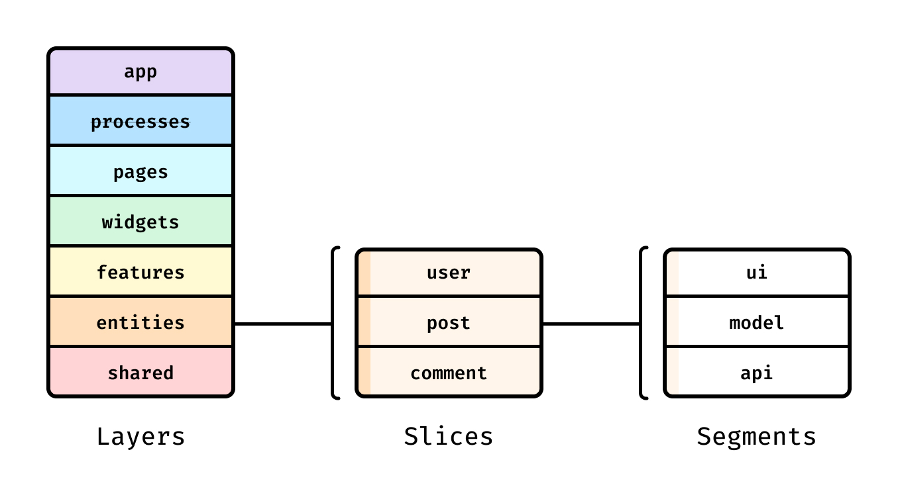

Проект на FSD состоит из слоев (layers), каждый слой состоит из слайсов (slices) и каждый слайс состоит из сегментов (segments).

Слои стандартизированы во всех проектах и расположены вертикально. 

Модули на одном слое могут взаимодействовать лишь с модулями, находящимися на слоях строго ниже. 

На данный момент слоев семь (снизу вверх):

**shared** — переиспользуемый код, не имеющий отношения к специфике приложения/бизнеса.(например, UIKit, libs, API)

**entities** (сущности) — бизнес-сущности.(например, User, Product, Order)

**features** (фичи) — взаимодействия с пользователем, действия, которые несут бизнес-ценность для пользователя.(например, SendComment, AddToCart, UsersSearch)

**widgets** (виджеты) — композиционный слой для соединения сущностей и фич в самостоятельные блоки(например, IssuesList, UserProfile).

**pages** (страницы) — композиционный слой для сборки полноценных страниц из сущностей, фич и виджетов.

**processes** (процессы, устаревший слой) — сложные сценарии, покрывающие несколько страниц.(например, авторизация)

**app** — настройки, стили и провайдеры для всего приложения.

Затем есть слайсы, разделяющие код по предметной области. Они группируют логически связанные модули, что облегчает навигацию по кодовой базе. Слайсы не могут использовать другие слайсы на том же слое, что обеспечивает высокий уровень связности (cohesion) при низком уровне зацепления (coupling).

В свою очередь, каждый слайс состоит из сегментов. Это маленькие модули, главная задача которых — разделить код внутри слайса по техническому назначению. Самые распространенные сегменты — ui, model (store, actions), api и lib (utils/hooks), но в вашем слайсе может не быть каких-то сегментов, могут быть другие, по вашему усмотрению.

**Примеры из моего проекта:**

**APP** — настройки, стили и провайдеры для всего приложения

**PAGES** (страницы) — композиционный слой для сборки полноценных страниц из сущностей, фич и виджетов

**WIDGETS** (виджеты) — композиционный слой для соединения сущностей и фич в самостоятельные блоки

**FEATURES** (фичи) — взаимодействия с пользователем, действия, которые несут бизнес-ценность для пользователя

**ENTITIES** (сущности) — бизнес-сущности

**SHARED** — переиспользуемый код, не имеющий отношения к специфике приложения/бизнеса

